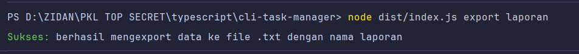
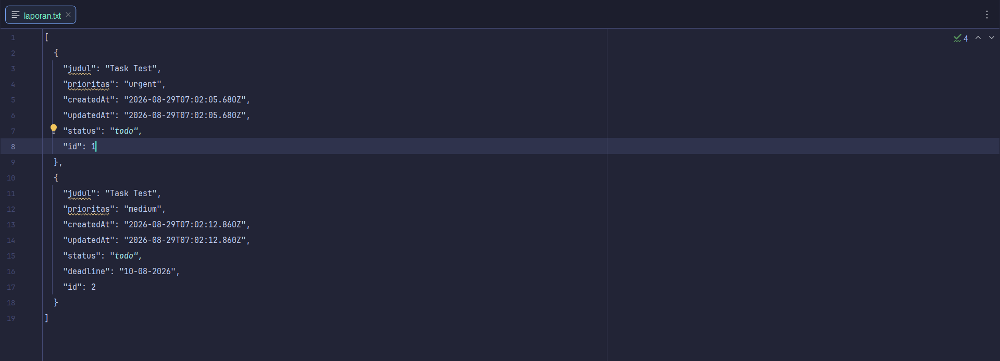
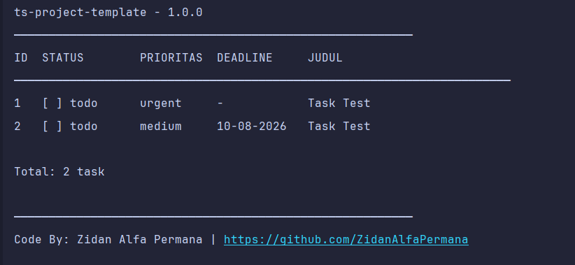
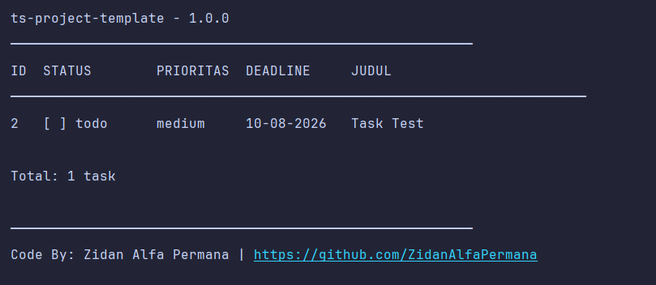
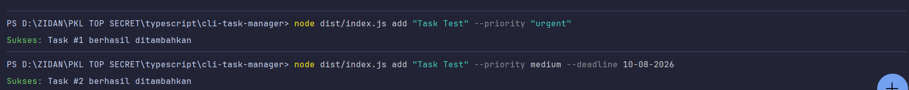
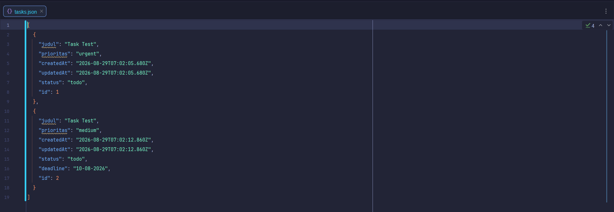

# CLI Task Manager

Aplikasi pengelola tugas berbasis command line yang dibangun dengan TypeScript.

## Fitur

- Tambah, lihat, edit, ubah status, dan hapus task
- Atur prioritas dan deadline pada task
- Filter task berdasarkan status dan prioritas, serta urutkan berdasarkan deadline
- Pencarian task berdasarkan kata kunci
- Statistik penyelesaian task
- Ekspor daftar task ke dalam file teks (.txt)
- Data tersimpan otomatis dalam file JSON

## Teknologi

- TypeScript 5.x
- Node.js 20 LTS
- Tanpa dependency eksternal (hanya @types/node)

## Instalasi

```bash
git clone https://github.com/ZidanAlfaPermana/cli-task-manager.git
cd cli-task-manager
npm install
npm run build
```


## Cara Menggunakan

```bash
node dist/index.js add "Belajar TypeScript"                                    # tambah task baru
node dist/index.js add "Mengerjakan PR" --priority urgent                      # tambah task dengan prioritas
node dist/index.js add "Meeting Klien" --priority high --deadline 29-10-2026   # tambah task dengan prioritas dan deadline
node dist/index.js list                                                        # lihat semua task
node dist/index.js list --status todo                                          # filter task berdasarkan status
node dist/index.js list --priority urgent                                      # filter task berdasarkan prioritas
node dist/index.js list --sort deadline                                        # urutkan task berdasarkan deadline terdekat
node dist/index.js list --status in_progress --priority high --sort deadline   # filter ganda dan urutkan
node dist/index.js progress 2                                                  # tandai task dikerjakan
node dist/index.js done 1                                                      # tandai task selesai
node dist/index.js edit 1 "Belajar Laravel 11"                                 # ubah judul task
node dist/index.js priority 1 high                                             # ubah prioritas task
node dist/index.js deadline 1 30-10-2026                                       # ubah deadline task
node dist/index.js search "typescript"                                         # cari task berdasarkan judul
node dist/index.js delete 3                                                    # hapus task
node dist/index.js stats                                                       # lihat statistik produktivitas
node dist/index.js export "laporan"                                            # export laporan ke file .txt
node dist/index.js help, --help, -h                                                        # tampilkan menu bantuan
```

## Struktur Project

```log
src/
├── types/          Definisi tipe data
├── models/         Class entity
├── repositories/   Akses data
├── services/       Business logic & storage
├── cli/            Interface terminal
└── utils/          Helper function
```

## Screenshot

### Export Data menjadi `.txt`





### List Task





### Penambahan Task




### Json Data atau Database local



## Konsep TypeScript yang Digunakan

- Interface & Type Alias (Minggu 2)
- Discriminated Union untuk command parsing (Minggu 2)
- Class, Getter, Inheritance (Minggu 3-4)
- Generics — Repository Pattern (Minggu 5)
- Utility Types: Omit, Partial (Minggu 6)
- Modules & Path Alias (Minggu 7)

## Pengembang

[Zidan Alfa Permana](https://zidanalfapermana.github.io) — Peserta Magang Batch 4 PT Nawasena Insan Permata